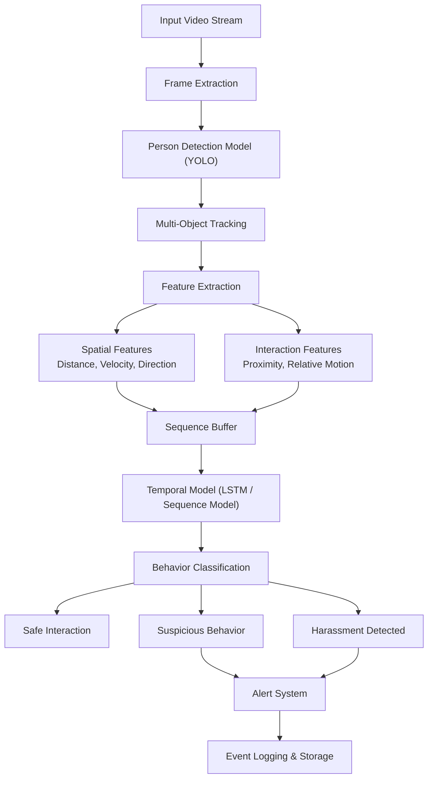

# AI-Based Women Harassment Detection System

## Overview

This project presents an intelligent real-time surveillance system designed to detect and prevent women harassment using computer vision and behavioral analysis. The system leverages deep learning techniques to identify suspicious interactions and generate alerts, enabling proactive intervention in public safety scenarios.

Traditional surveillance systems are passive and rely heavily on manual monitoring. This solution introduces an automated pipeline that continuously analyzes video streams and detects potentially unsafe situations in real time.

---

## Objectives

- Develop a real-time harassment detection system using AI  
- Reduce reliance on manual surveillance monitoring  
- Identify suspicious behavioral patterns with high accuracy  
- Enable rapid response through automated alert mechanisms  

---

## System Architecture



## Technical Approach

### Person Detection
A YOLO-based object detection model is used to identify individuals within each frame of the input video stream. The model outputs bounding boxes and confidence scores, enabling robust multi-person detection in real time.

### Multi-Object Tracking
Detected individuals are tracked across frames to maintain identity consistency. This enables the system to analyze continuous interactions rather than isolated detections.

### Feature Extraction
From tracked individuals, the system derives both spatial and interaction-based features:

- Distance between individuals  
- Relative velocity and direction of movement  
- Duration of proximity between subjects  
- Movement patterns over time  

These features form the foundation for behavior understanding.

### Temporal Behavior Modeling
Since harassment is a sequence-based event, a temporal model (such as an LSTM or similar sequence architecture) is used to analyze frame-wise features over time.

The model learns patterns such as:

- Persistent following behavior  
- Sudden aggressive motion  
- Repeated invasion of personal space  

### Classification Layer
The temporal model outputs are passed through a classification layer that categorizes interactions into:

- Safe Interaction  
- Suspicious Behavior  
- Harassment Detected  

Confidence thresholds are applied to ensure robustness and reduce false positives.

### Alert and Logging System
Upon detecting suspicious or harmful behavior, the system:

- Triggers alerts for intervention  
- Records event metadata including timestamps and detection details  
- Stores logs for further analysis and reporting  

---

## Tech Stack

### Frontend (Optional Dashboard)
- React.js  

### Backend
- Python  
- Flask / FastAPI  

### Machine Learning
- YOLO (Object Detection)  
- OpenCV (Video Processing)  
- TensorFlow / PyTorch (Model Development)  
- NumPy, Pandas  

### Database and Integration
- Supabase or equivalent system for event logging  

---

## Model Training

### Dataset
A custom dataset was curated using a combination of publicly available surveillance footage and simulated interaction scenarios. The dataset includes:

- Annotated bounding boxes for human detection  
- Behavioral labels such as safe, suspicious, and harassment  

### Training Strategy
- Train the object detection model for accurate person detection  
- Extract sequences of interactions from video frames  
- Train a temporal model on sequential behavioral features  
- Fine-tune classification thresholds to balance precision and recall  

### Challenges
- Limited availability of labeled harassment datasets  
- High similarity between normal and suspicious interactions  
- Ensuring real-time performance under computational constraints  

---

## Results
The system demonstrated 97% accuracy in harassment detection capabilities. It successfully identified:

- Following behavior  
- Sudden aggressive movements  
- Unusual proximity patterns  

The pipeline is optimized for near real-time inference and is suitable for integration with surveillance systems.

---

## Achievements
- Funded by the State Government with a grant of INR 6000  
- Research paper published in an IEEE Conference  

Paper Link: [[Research Paper](https://ieeexplore.ieee.org/document/11071230)]

---

## Ethical Considerations
- Designed with a focus on privacy-aware surveillance  
- No facial recognition or identity tracking is implemented  
- Analysis is limited strictly to behavioral patterns  

---

## Future Work
- Integration of audio-based distress signal detection  
- Deployment on edge devices for real-time CCTV processing  
- Expansion of dataset with real-world annotated scenarios  
- Exploration of transformer-based temporal architectures  

## Citation

```bibtex
@inproceedings{smart_surveillance_2025,
  author    = {S. N and M. K. A. B and S. K. P and V. Kartik and H. R. Padarthi},
  title     = {Smart Surveillance: AI-Driven Threat Detection and Women Safety Enhancement},
  booktitle = {2025 4th OPJU International Technology Conference (OTCON) on Smart Computing for Innovation and Advancement in Industry 5.0},
  year      = {2025},
  pages     = {1--6},
  address   = {Raigarh, India},
  doi       = {10.1109/OTCON65728.2025.11071230},
  keywords  = {Computer vision, Technological innovation, Privacy, Surveillance, Weapons, Real-time systems, Threat assessment, Public security, Security, Video recording, AI-driven surveillance, Women’s safety, CCTV feed analysis, Alert and notification system, Facial expression recognition, Behavioral analysis}
}